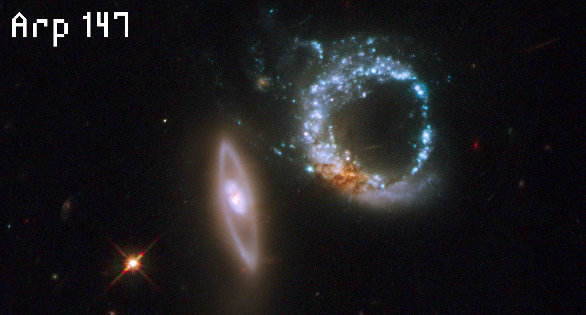

> Arp 147 (also known as IC 298) is an interacting pair of [ring galaxies](https://en.wikipedia.org/wiki/Ring_galaxies). It lies 430 million to 440 million light years away in the constellation [Cetus](https://en.wikipedia.org/wiki/Cetus) and does not appear to be part of any significant [galaxy group](https://en.wikipedia.org/wiki/Galaxy_group). The system was originally discovered in 1893 by [Stephane Javelle](https://en.wikipedia.org/wiki/Stephane_Javelle) and is listed in the [Atlas of Peculiar Galaxies](https://en.wikipedia.org/wiki/Atlas_of_Peculiar_Galaxies).
>
> [Source](https://en.wikipedia.org/wiki/Arp_147)
